# BlaBla

**Executable, queryable project intent for humans and coding agents.**

[](https://github.com/Kiborgik/blabla/actions/workflows/release.yml)


[](https://doi.org/10.5281/zenodo.22761364)

Keep what the software must do, how its code is constrained, and why the project works that way in the repository. Agents query the relevant identity instead of rebuilding context from chat. BlaBla verifies declared **Behavior** and **Structure**; Mission, System, Process, Knowledge and Goals guide the work without deciding completion.

**0.10.0 is a release candidate, not yet published.** It adds revision-bound handoffs and an experimental expert layer. [Upgrade notes](CHANGELOG.md#0100-unreleased) · [release evidence](docs/design/0.10-release-evidence.md)

## Start here

Install the published crate with stable Rust (this does not install the 0.10.0 release candidate):

```sh
cargo install blabla --locked
```

In an existing BlaBla project:

```sh
blabla status
blabla explain <identity-from-status>
# Change the implementation; preserve the declared intent.
blabla finish
```

For a new project, `blabla init --agents --command python ./main.py` creates a manifest, a **draft** behavior contract, managed `AGENTS.md` instructions and a portable skill without overwriting existing files. Run `blabla guide bootstrap` to adapt the contract and connect the real application. Drafts do not count toward completion; `init` does not implement the application or its adapter.

To try **this source version**, start from a checkout containing it, currently the `release/0.10-expert-loop` branch. Run from that checkout with Python 3.10+ installed; Cargo uses its current source:

```sh
cargo run --release --quiet --bin blabla -- --project examples/todo status
cargo run --release --quiet --bin blabla -- --project examples/todo finish
```

To install this candidate locally instead, run `cargo install --path . --locked` from its checkout. This builds the checked-out source; it does not fetch a published 0.10.0 crate.

The first command may report UNVERIFIED/BLOCKED; the second runs the example's canonical campaign. The same [Todo behavior contract](examples/todo.bla) drives [Python](examples/todo), [TypeScript](examples/todo-ts), [Go](examples/todo-go), [C](examples/todo-c), [C++](examples/todo-cpp) and [Java](examples/todo-java) applications through small reusable [JSON Lines adapters](adapters/README.md).

## What is checked



| Surface | Declares | Authority |
| --- | --- | --- |
| Behavior | observable state, actions, invariants and postconditions | finite generated campaigns, coverage obligations and minimized counterexamples |
| Structure | modules, symbols, dependencies, literal members and key/payload associations | static facts from supported source languages |
| Project memory | purpose, architecture, roles, expertise and goals | queryable intent; validated internally, not against the code |
| Tasks / expert | bounded handoffs / selected-context advice | development records and optional advice; neither changes `OVERALL` |

`project.bla` registers these surfaces and one canonical verification profile. `status` discovers it; `explain` opens one printed identity; `finish` reruns verification rather than trusting a cached GREEN.

- **GREEN:** every active declared obligation was exercised and satisfied under the configured verifier
- **YELLOW:** no violation found, but required behavior was not exercised
- **RED / ERROR:** a rule was violated / a fact could not be established
- **BLOCKED:** project completion is unavailable; only current canonical **OVERALL GREEN** passes

GREEN is bounded evidence, not proof of arbitrary correctness. Adapter observations are trusted. Structure never executes project code and supports Python, Rust, TypeScript/JavaScript, Go, Java, C and C++; unsupported or undecidable facts are ERROR. [Exact completion semantics](docs/project.md#layers-and-completion) · [provider limits](docs/structure.md#providers)

## Full development workflow



A project can use bounded tasks to carry scope, deliverables, questions and findings across sessions. Workers accept before editing, run the declared check, assess consulted expertise and challenge the record before handing back. Reviewers inspect the work independently; the orchestrator settles findings, integrates and verifies the project. BlaBla records and checks the handoff prerequisites; the host or person launches and coordinates agents.

[Working commands, recovery and review freshness](docs/agent-workflow.md) · `blabla guide agent` · `blabla guide loop`

## New in 0.10

- **Fresh evidence and review:** exact check identity, declared inputs and acceptance epochs prevent old evidence, lens assessments or reviews from approving changed work
- **Explicit ownership:** live write scopes cannot overlap; withdrawal releases ownership while retaining unresolved changes
- **Bounded expert evaluation:** fixed Choice/Noul/Score questions, selected packets, provider transport, deterministic policy, replay and calibration tooling; optional cooperative native between-turn experiments
- **Verifier and adapter repairs:** broader String boundaries, preserved companion fields for missing-identity witnesses, C persistence and Python UTF-8 fixes; see the [changelog](CHANGELOG.md#0100-unreleased)

The expert layer can flag goal drift, unsupported claims, repeated approaches or useful expertise at an observed host boundary. It cannot read arbitrary work continuously, grant scope or change verdicts. Repository bindings remain shadow-only; no judgment is promoted. Real Kev calibration selected **no feasible policy**, so runtime expert benefit is unestablished. [Expert setup, host boundaries and qualification limits](docs/expert.md)

## Reference

| Need | Read |
| --- | --- |
| Behavior syntax and adapter protocol | [Language](docs/language.md) |
| Static rules and language-specific limits | [Structure](docs/structure.md) |
| Manifest, memory schemas, identities and completion | [Project](docs/project.md) |
| Assign, implement, review and recover a task | [Agent workflow](docs/agent-workflow.md) |
| Expert definitions, commands and host integration | [Expert](docs/expert.md) |
| Implementation map and stable interfaces | [Architecture](docs/architecture.md) |
| Project invariants and non-goals | [BLA_BLA.md](BLA_BLA.md) |
| What experiments actually established | [Research](docs/research.md), [RTS dogfooding](docs/evidence/rts-dogfooding.md) |

BlaBla does not generate a specification, plan or implementation. It complements ordinary tests and development tools; it is not a Spec Kit replacement, theorem prover or autonomous agent runner. Pre-1.0 syntax, CLI, JSON and exit-code changes ship in minor releases with Breaking notes; patches preserve those interfaces.

## Contributing, citation and license

False GREEN reports are especially useful: include the contract, profile/seed, version, platform and a minimal reproduction. [Contributing](CONTRIBUTING.md) · [Security](SECURITY.md) · [Code of conduct](CODE_OF_CONDUCT.md)

Citation: [CITATION.cff](CITATION.cff). License: [MIT](LICENSE).
